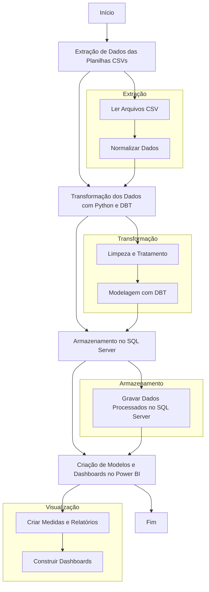

# Teste prático processo seletivo Ibrowse

> Desafio prático relacionado ao processo seletivo para ANALISTA DE DADOS 
> Candidato: Hemerson Douglas Alves Godinho
> E-mail: douglas_godinho@hotmail.com
> Data Execução: 31/03/2025

## Pré-requisitos 

Projeto ABC BANK

Este projeto foi desenvolvido para a ABC Bank e utiliza DBT (Data Build Tool) e Python para gerenciar e transformar os dados de um Data Warehouse (DW). O banco de dados SQL Server é utilizado para armazenar as informações relacionadas às operações financeiras da empresa. Para análise e visualização, o Power BI foi empregado na criação de dashboards interativos, possibilitando uma tomada de decisão mais estratégica baseada em dados precisos.

## Estrutura do Projeto


1. Seeds
Os seeds são dados estáticos carregados no Data Warehouse a partir de arquivos CSV. Neste projeto, usamos seeds para carregar dados de operações financeiras.

2. Models
Os models definem as transformações de dados usando SQL. Eles são divididos em duas camadas principais: staging e datamart.

Staging
A camada de staging é responsável por preparar e limpar os dados antes que eles sejam carregados nas tabelas finais de análise.

stg_operacoes_diretas.sql: Trata e formata os dados de operacoes diretas extraídos da planilha csv.
stg_operacoes_diretas.sql: Trata e formata os dados de operacoes indiretas extraídos da planilha csv.

Datamart
A camada de datamart é onde os dados finais de análise são armazenados. Eles são baseados nos dados preparados pela camada de staging.

3. Sources
Os sources são as tabelas ou arquivos de origem dos dados que o DBT utiliza para realizar as transformações.

4. Snapshots
Os snapshots são utilizados para manter um histórico de como os dados mudam ao longo do tempo.

Estrutura de Diretórios

```plaintext
├── models
│   ├── staging
│   │   ├── stg_operacoes_diretas.sql
│   │   └── stg_operacoes_indiretas.sql
│   └── datamart
│       ├── dm_dim_clientes_op_diretas.sql
│       ├── dm_dim_clientes_op_indiretas.sql
│       ├── dm_fato_operacoes_diretas.sql
│       ├── dm_fato_operacoes_indiretas.sql
├── seeds
│   └── movimentacao_commodities.csv
├── dbt_project.yml
└── README.md
```


Executando o Projeto

Requisitos
Python 3.12
DBT
Passos para Execução
Clonar o Repositório:

git clone <URL-do-Repositório>
cd <Nome-do-Repositório>
Instalar o DBT:

pip install dbt-core dbt-postgres
Configurar o DBT:

Configure o arquivo profiles.yml para se conectar ao seu Data Warehouse. O arquivo deve estar no diretório ~/.dbt/ ou no diretório especificado pela variável de ambiente DBT_PROFILES_DIR.
Exemplo de profiles.yml:

databasesales:
  target: dev
  outputs:
    dev:
      type: postgres
      host: <DB_HOST_PROD>
      user: <DB_USER_PROD>
      password: <DB_PASS_PROD>
      port: <DB_PORT_PROD>
      dbname: <DB_NAME_PROD>
      schema: <DB_SCHEMA_PROD>
      threads: 1


Executar os Seeds do DBT:

dbt seed
Executar as Transformações do DBT:

dbt run
Verificar o Estado do Projeto:

dbt test


